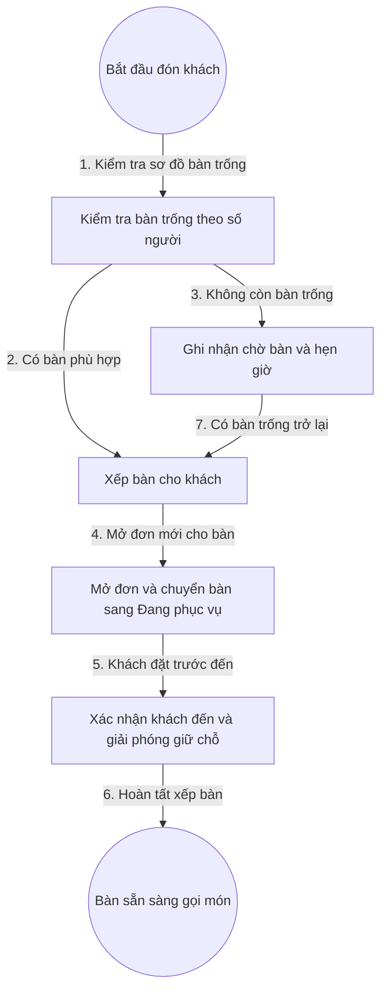

# 2. Quản Lý Bàn Và Đặt Bàn

## 1. Mục Tiêu

- Nhìn một màn hình biết ngay bàn nào trống, bàn nào bận, bàn nào đã đặt trước.
- Xếp bàn đúng sức chứa, đúng khu vực khách mong muốn, không trùng lắp.
- Giữ chỗ có thời hạn, chống chiếm bàn ảo.

## 2. Mô Hình Dữ Liệu

- Bàn: mã bàn, tên hiển thị, khu vực, sức chứa, trạng thái.
- Trạng thái bàn: Trống, Đã đặt trước, Đang phục vụ, Đang dọn dẹp, Tạm ngưng.
- Phiếu đặt bàn: tên khách, số điện thoại, giờ đến, số người, tiền cọc nếu có, trạng thái giữ chỗ.

## 3. Quy Tắc Chuyển Trạng Thái

- Trống chỉ được chuyển sang Đã đặt trước hoặc Đang phục vụ.
- Đã đặt trước khi khách đến thì chuyển sang Đang phục vụ và mở đơn.
- Đang phục vụ khi thanh toán xong thì chuyển sang Đang dọn dẹp.
- Đang dọn dẹp khi xác nhận dọn xong thì về Trống.
- Tạm ngưng không nhận xếp bàn cho đến khi mở lại.

## 4. Flowchart Chi Tiết

| Bước | Tác nhân | Hành động | Dữ liệu truyền | Kết quả mong đợi |
|---|---|---|---|---|
| 1 | Nhân viên phục vụ | Lọc bàn trống | Số người, khu vực | Danh sách bàn phù hợp hiện ra |
| 2 | Nhân viên phục vụ | Chọn bàn và xác nhận xếp | Mã bàn, mã khách | Bàn được giữ tạm cho lượt này |
| 3 | Nhân viên phục vụ | Ghi chờ bàn | Tên khách, số điện thoại | Khách vào hàng đợi, có hẹn giờ |
| 4 | Hệ thống | Mở đơn và khóa bàn | Mã bàn | Bàn chuyển sang Đang phục vụ, sinh đơn mới |
| 5 | Nhân viên phục vụ | Xác nhận khách đặt trước đến | Mã phiếu đặt | Giải phóng giữ chỗ, gắn đơn vào bàn |
| 6 | Hệ thống | Hoàn tất | Mã đơn, mã bàn | Bàn sẵn sàng cho luồng gọi món |
| 7 | Hệ thống | Báo bàn trống | Sự kiện bàn trống | Tự gợi ý xếp khách đang chờ |

**Ý nghĩa và ràng buộc cốt lõi**: Khóa bàn ở tầng máy chủ để hai nhân viên không xếp trùng. Phiếu đặt quá 15 phút không đến phải nhắc xác nhận trước khi giải phóng, tránh mất khách mà vẫn chống giữ bàn ảo.

## 5. API Contract (Tóm Tắt)

- Mở đơn cho bàn: nhận mã bàn, trả về mã đơn, phiên bản bàn để chống ghi đè.
- Xác nhận đến cho phiếu đặt: nhận mã phiếu đặt, trả về mã bàn và mã đơn.
- Hoàn tất dọn bàn: nhận mã bàn, chuyển về Trống.

## 6. Gợi Ý Giao Diện

- Màn hình sơ đồ bàn theo khu vực, màu sắc theo trạng thái, chạm một lần xem chi tiết, chạm giữ để mở tác vụ nhanh.
- 6 microstates cho nút Xếp bàn, Mở đơn, Dọn xong: mặc định, di chuột, bàn phím, đang nhấn, bị cấm, đang tải.
- Phản hồi 4 tầng: cảnh báo ngay tại ô bàn, biểu ngữ trong màn hình ca, thông báo trượt khi có bàn trống, hộp chặn khi trùng bàn.
