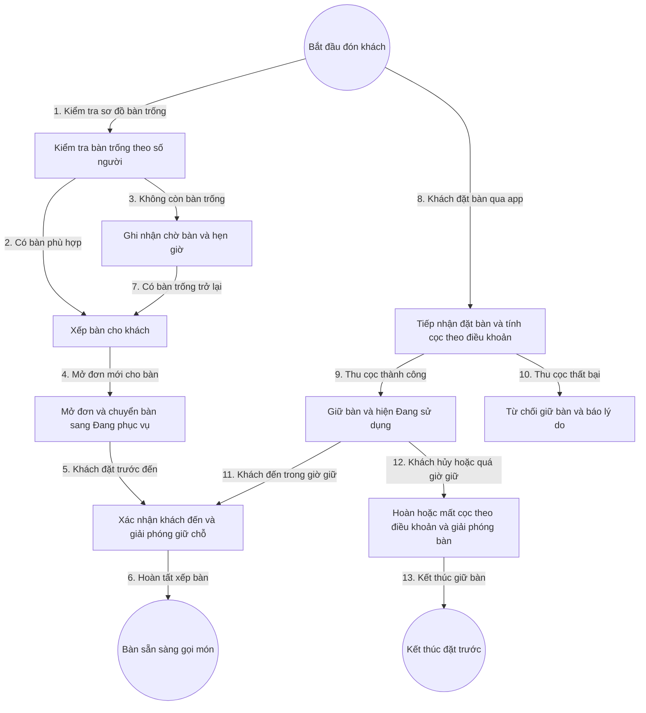

# 2. Quản Lý Bàn Và Đặt Bàn

## 1. Mục Tiêu

- Nhìn một màn hình biết ngay bàn nào trống, bàn nào bận, bàn nào đã đặt trước và đang giữ cọc.
- Xếp bàn đúng sức chứa, đúng khu vực khách mong muốn, không trùng lắp.
- Giữ chỗ theo thời gian trong điều khoản, chống chiếm bàn ảo bằng cọc.

## 2. Mô Hình Dữ Liệu

- Bàn: mã bàn, tên hiển thị, khu vực, sức chứa, trạng thái.
- Trạng thái bàn: Trống, Đã đặt trước, Đang phục vụ, Đang dọn dẹp, Tạm ngưng.
- Phiếu đặt bàn qua app: tên khách, số điện thoại, giờ đến, số người, danh sách món đặt trước nếu có, tiền cọc đã thu, trạng thái giữ chỗ.
- Form điều khoản 1-1 theo nhà hàng, do chủ hoặc quản lý điền ngay khi dùng app lần đầu: mức cọc khi đã gọi món, mức cọc khi chưa gọi món (số tiền hoặc phần trăm), thời hạn được hủy hoàn cọc, thời hạn hủy mất cọc, mức hoàn cọc, mức mất cọc, thời gian giữ bàn, cho phép gia hạn giữ bàn, phí xử lý khi quá thời gian giữ bàn.

## 3. Quy Tắc Chuyển Trạng Thái

- Trống chỉ được chuyển sang Đã đặt trước hoặc Đang phục vụ.
- Đặt bàn qua app bắt buộc thu cọc theo điều khoản trước khi giữ bàn.
- Bàn đang giữ hiện Đang sử dụng trên app và không xếp khách khác cho đến hết thời gian giữ.
- Đã đặt trước khi khách đến thì chuyển sang Đang phục vụ và mở đơn, cọc được khấu trừ khi thanh toán.
- Khách hủy trước giờ đặt thì hoàn hoặc mất cọc tự động theo thời hạn và mức trong điều khoản.
- Quá thời gian giữ mà khách chưa đến thì giải phóng bàn và xử lý cọc hoặc phí quá giờ theo điều khoản.
- Gia hạn giữ bàn chỉ cho phép khi điều khoản bật cho phép gia hạn.
- Đang phục vụ khi thanh toán xong thì chuyển sang Đang dọn dẹp.
- Đang dọn dẹp khi xác nhận dọn xong thì về Trống.
- Tạm ngưng không nhận xếp bàn cho đến khi mở lại.

## 4. Flowchart Chi Tiết

| Bước | Tác nhân | Hành động | Dữ liệu truyền | Kết quả mong đợi |
|---|---|---|---|---|
| 1 | Nhân viên phục vụ | Lọc bàn trống | Số người, khu vực | Danh sách bàn phù hợp hiện ra |
| 2 | Nhân viên phục vụ | Chọn bàn và xác nhận xếp | Mã bàn, mã khách | Bàn được giữ tạm cho lượt này |
| 3 | Nhân viên phục vụ | Ghi chờ bàn | Tên khách, số điện thoại | Khách vào hàng đợi, có hẹn giờ |
| 4 | Hệ thống | Mở đơn và khóa bàn | Mã bàn | Bàn chuyển sang Đang phục vụ, sinh đơn mới |
| 5 | Nhân viên phục vụ | Xác nhận khách đặt trước đến | Mã phiếu đặt | Giải phóng giữ chỗ, gắn đơn vào bàn, cọc khấu trừ khi thanh toán |
| 6 | Hệ thống | Hoàn tất | Mã đơn, mã bàn | Bàn sẵn sàng cho luồng gọi món |
| 7 | Hệ thống | Báo bàn trống | Sự kiện bàn trống | Tự gợi ý xếp khách đang chờ |
| 8 | Khách hàng | Đặt bàn qua app | Giờ đến, số người, món đặt trước | Tính cọc theo điều khoản nhà hàng |
| 9 | Hệ thống | Thu cọc và giữ bàn | Mã phiếu đặt, số tiền cọc | Bàn giữ chỗ và hiện Đang sử dụng |
| 10 | Hệ thống | Từ chối giữ bàn | Lý do thu cọc thất bại | Khách nhận thông báo rõ ràng |
| 11 | Nhân viên phục vụ | Xác nhận khách đến | Mã phiếu đặt | Chuyển bàn sang Đang phục vụ |
| 12 | Hệ thống | Hoàn hoặc mất cọc | Thời điểm hủy so với giờ đặt | Áp dụng mức trong điều khoản, giải phóng bàn |
| 13 | Hệ thống | Kết thúc đặt trước | Lịch sử cọc và giữ bàn | Đóng luồng đặt trước |

**Ý nghĩa và ràng buộc cốt lõi**: Khóa bàn ở tầng máy chủ để hai nhân viên không xếp trùng. Đặt qua app bắt buộc cọc trước khi giữ bàn, bàn đang giữ hiện Đang sử dụng nên không thể xếp trùng. Gia hạn chỉ cho khi điều khoản bật. Mọi thu, hoàn và mất cọc đều ghi vết để đối soát.

## 5. API Contract (Tóm Tắt)

- Cấu hình điều khoản 1-1: nhận 9 trường điều khoản của nhà hàng, lưu vào cơ sở dữ liệu.
- Thu cọc đặt bàn: nhận mã phiếu đặt, tính cọc theo điều khoản, trả về mã giao dịch cọc.
- Hoàn hoặc mất cọc: nhận mã phiếu đặt và thời điểm hủy, áp dụng mức trong điều khoản, ghi vết đầy đủ.
- Gia hạn giữ bàn: nhận mã phiếu đặt, chỉ cho khi điều khoản bật cho phép gia hạn.
- Mở đơn cho bàn: nhận mã bàn, trả về mã đơn, phiên bản bàn để chống ghi đè.
- Xác nhận đến cho phiếu đặt: nhận mã phiếu đặt, trả về mã bàn và mã đơn.
- Hoàn tất dọn bàn: nhận mã bàn, chuyển về Trống.

## 6. Gợi Ý Giao Diện

- Màn hình sơ đồ bàn theo khu vực, màu sắc theo trạng thái, bàn đang giữ cọc hiện Đang sử dụng, chạm một lần xem chi tiết, chạm giữ để mở tác vụ nhanh.
- 6 microstates cho nút Xếp bàn, Mở đơn, Thu cọc, Gia hạn, Dọn xong: mặc định, di chuột, bàn phím, đang nhấn, bị cấm, đang tải.
- Trang điều khoản cho chủ và quản lý điền 9 trường ngay khi dùng app lần đầu, có kiểm tra hợp lệ từng trường.
- Phản hồi 4 tầng: cảnh báo ngay tại ô bàn, biểu ngữ trong màn hình ca, thông báo trượt khi thu cọc xong, hộp chặn khi thu cọc thất bại hoặc gia hạn không được phép.
