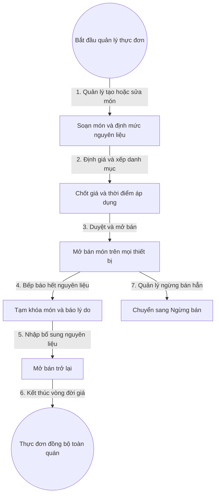

# 3. Quản Lý Thực Đơn

## 1. Mục Tiêu

- Thực đơn luôn đúng giá, đúng món còn bán, hình ảnh rõ ràng.
- Khóa món hết nhanh trên mọi thiết bị khi bếp báo hết.
- Thay đổi giá không làm sai lệch đơn cũ.

## 2. Mô Hình Dữ Liệu

- Danh mục: tên danh mục, thứ tự hiển thị, khung giờ áp dụng.
- Món ăn: tên món, mô tả, giá bán hiện hành, hình ảnh, danh mục, trạng thái Còn bán, Tạm hết, Ngừng bán.
- Bảng giá theo thời điểm: lưu vết mỗi lần đổi giá để chốt giá đơn cũ.
- Định mức nguyên liệu: mỗi món gồm danh sách nguyên liệu và số lượng hao hụt.

## 3. Quy Tắc

- Chỉ món ở trạng thái Còn bán mới được thêm vào đơn mới.
- Đổi giá chỉ áp dụng cho đơn mở sau thời điểm đổi.
- Món Tạm hết do bếp báo sẽ tự khóa trên màn hình gọi món trong toàn ca.
- Món Ngừng bán phải được quản lý duyệt và không hiện với nhân viên phục vụ.

## 4. Flowchart Chi Tiết

| Bước | Tác nhân | Hành động | Dữ liệu truyền | Kết quả mong đợi |
|---|---|---|---|---|
| 1 | Quản lý | Soạn món | Tên món, mô tả, định mức | Món nháp được lưu |
| 2 | Quản lý | Định giá | Giá bán, giờ áp dụng | Sinh bản giá mới có hiệu lực |
| 3 | Quản lý | Duyệt mở bán | Mã món | Món hiện trên màn hình gọi món |
| 4 | Nhân viên bếp | Báo hết món | Mã món, lý do | Món bị khóa tạm thời |
| 5 | Thủ kho | Nhập bổ sung | Phiếu nhập | Món được mở bán trở lại |
| 6 | Hệ thống | Đồng bộ | Sự kiện đổi thực đơn | Mọi thiết bị cùng một thực đơn |
| 7 | Quản lý | Ngừng bán | Mã món, lý do | Món ẩn khỏi màn hình gọi món |

**Ý nghĩa và ràng buộc cốt lõi**: Tách bản giá khỏi món ăn để giữ lịch sử giá. Mọi khóa mở món đều phát sự kiện thời gian thực, tránh nhân viên gọi món đã hết gây phiền cho khách.

## 5. API Contract (Tóm Tắt)

- Tạo món: nhận tên, giá, danh mục, định mức; trả về mã món.
- Đổi giá: nhận mã món và giá mới, sinh bản giá có mốc thời gian.
- Báo hết và mở lại món: nhận mã món và lý do, đổi trạng thái tương ứng.

## 6. Gợi Ý Giao Diện

- Lưới món theo danh mục, ô tìm kiếm, bộ lọc Còn bán và Tạm hết.
- Huy hiệu Tạm hết đè lên ảnh món, nút thêm món bị cấm kèm chú thích lý do.
