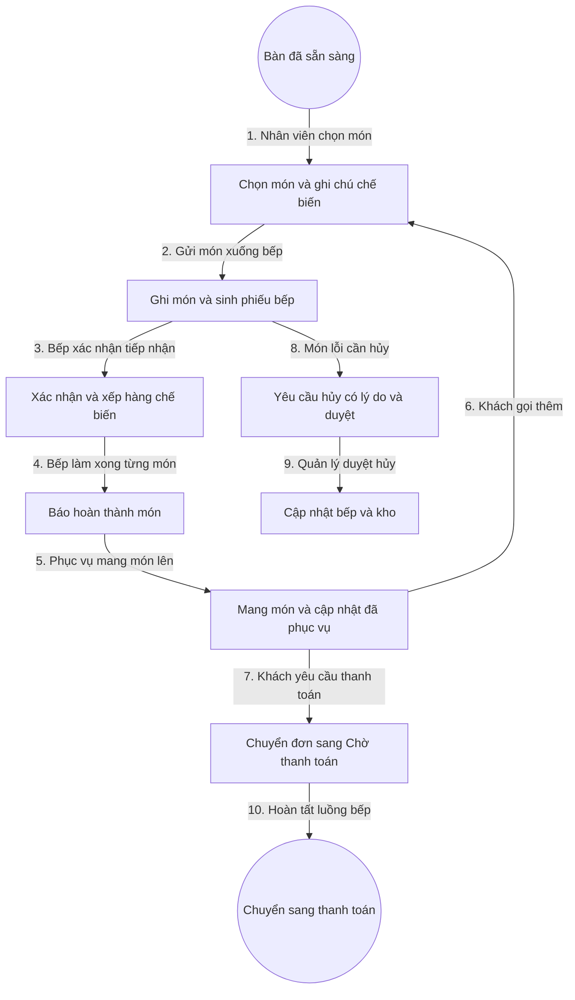

# 4. Quản Lý Đơn Hàng Và Bếp

## 1. Mục Tiêu

- Ghi món nhanh, ít chạm, không nhầm bàn, không sót bếp.
- Bếp thấy đúng thứ tự cần làm, ưu tiên món lâu và bàn đông.
- Mọi thay đổi món đều có vết và được bếp xác nhận.

## 2. Mô Hình Dữ Liệu

- Đơn hàng: mã đơn, mã bàn, người mở, giờ mở, trạng thái.
- Trạng thái đơn: Mới mở, Đang phục vụ, Chờ thanh toán, Đã thanh toán, Đã hủy.
- Dòng món: mã món, số lượng, giá chốt, ghi chú, trạng thái chế biến.
- Trạng thái chế biến: Chờ bếp xác nhận, Đang chế biến, Đã hoàn thành, Đã hủy có duyệt.
- Phiếu bếp: nhóm dòng món theo bếp nóng, bếp lạnh, quầy pha chế.

## 3. Quy Tắc

- Thêm món chốt giá tại thời điểm thêm, không trôi theo giá mới.
- Thêm món và sinh phiếu bếp phải cùng một giao dịch.
- Hủy sau khi bếp nhận phải có lý do và mã duyệt quản lý.
- Không cho chuyển sang Chờ thanh toán khi còn món chưa hoàn thành.

## 4. Flowchart Chi Tiết

| Bước | Tác nhân | Hành động | Dữ liệu truyền | Kết quả mong đợi |
|---|---|---|---|---|
| 1 | Nhân viên phục vụ | Chọn món | Mã món, số lượng, ghi chú | Giỏ món tạm được kiểm tra còn bán |
| 2 | Hệ thống | Ghi món | Mã đơn, danh sách món | Sinh dòng món và phiếu bếp nguyên tử |
| 3 | Nhân viên bếp | Xác nhận | Mã phiếu bếp | Món chuyển sang Đang chế biến |
| 4 | Nhân viên bếp | Báo xong | Mã dòng món | Món chuyển sang Đã hoàn thành, bếp trống làm món tiếp |
| 5 | Nhân viên phục vụ | Mang món | Mã dòng món | Cập nhật đã phục vụ, khách nhận đủ món nóng |
| 6 | Khách hàng | Gọi thêm | Món mới | Lặp vòng ghi món mà không mở đơn mới |
| 7 | Nhân viên phục vụ | Yêu cầu thanh toán | Mã đơn | Đơn chuyển sang Chờ thanh toán nếu không còn món dở |
| 8 | Nhân viên phục vụ | Yêu cầu hủy | Mã dòng món, lý do | Tạo yêu cầu chờ duyệt |
| 9 | Quản lý | Duyệt hủy | Mã duyệt | Bếp và kho được cập nhật, món hủy không tính tiền |
| 10 | Hệ thống | Chuyển bước | Mã đơn | Đơn sẵn sàng cho thu ngân |

**Ý nghĩa và ràng buộc cốt lõi**: Biên giao dịch chung cho đơn và phiếu bếp chống sót món. Hàng đợi bếp sắp xếp theo giờ gọi và độ ưu tiên để món lâu không bị bỏ quên. Mọi hủy món đều giữ vết phục vụ kiểm toán chống thất thoát.

## 5. API Contract (Tóm Tắt)

- Thêm món: nhận mã đơn và danh sách món, kiểm tra còn bán, trả về dòng món và phiếu bếp.
- Xác nhận bếp: nhận mã phiếu, chuyển dòng món sang Đang chế biến.
- Báo hoàn thành: nhận mã dòng món, trừ kho theo định mức.
- Yêu cầu và duyệt hủy: nhận lý do, mã duyệt, cập nhật trạng thái hủy.

## 6. Gợi Ý Giao Diện

- Màn hình gọi món: tìm kiếm nhanh, nút cộng trừ số lượng lớn, ghi chú mẫu một chạm.
- Màn hình bếp: thẻ món theo màu thời gian chờ, nút xác nhận lớn, chế độ lọc theo quầy.
