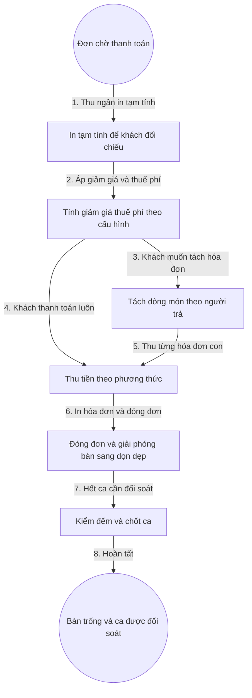

# 5. Thanh Toán Và Hóa Đơn

## 1. Mục Tiêu

- Tính đúng tiền: tiền món theo giá chốt, giảm giá đúng hạn mức, thuế và phí đúng cấu hình, khấu trừ cọc đặt bàn.
- Linh hoạt tách hóa đơn theo người trả. Đã bỏ gộp bàn, nhân viên và quản lý tự xử lý ngoài hệ thống.
- Chốt ca minh bạch, đối soát được tiền mặt và chuyển khoản.

## 2. Mô Hình Dữ Liệu

- Hóa đơn: mã hóa đơn, mã đơn, danh sách dòng tính tiền, giảm giá, thuế, phí phục vụ, tổng phải thu, phương thức thanh toán.
- Phương thức: Tiền mặt, Chuyển khoản, Thẻ, Ví điện tử.
- Ca bán hàng: giờ mở ca, người thu ngân, tiền đầu ca, tổng thu, tiền kiểm đếm, chênh lệch.

## 3. Quy Tắc

- Chỉ đơn ở trạng thái Chờ thanh toán mới được lập hóa đơn.
- Giảm giá vượt hạn mức nhân viên phải có mã duyệt quản lý.
- Tách hóa đơn không làm thay đổi tổng đơn gốc, chỉ chia dòng món.
- Tiền cọc đặt bàn được khấu trừ vào tổng phải thu khi chốt hóa đơn.
- Hoàn và mất cọc khi hủy hoặc quá giờ áp dụng tự động theo điều khoản của nhà hàng, ghi vết đầy đủ.
- Đóng ca phải kiểm đếm tiền mặt và xác nhận chênh lệch nếu có.

## 4. Flowchart Chi Tiết

| Bước | Tác nhân | Hành động | Dữ liệu truyền | Kết quả mong đợi |
|---|---|---|---|---|
| 1 | Thu ngân | In tạm tính | Mã đơn | Khách kiểm tra món và giá |
| 2 | Thu ngân | Áp khuyến mãi | Mã giảm giá, mức thuế | Tổng phải thu hiển thị đúng |
| 3 | Thu ngân | Tách hóa đơn | Danh sách dòng món theo người | Mỗi người một hóa đơn con, tổng khớp đơn gốc |
| 4 | Khách hàng | Trả tiền | Số tiền, phương thức | Ghi nhận giao dịch thanh toán |
| 5 | Thu ngân | Thu từng phần | Từng hóa đơn con | Không sót phần chưa thu |
| 6 | Hệ thống | Đóng đơn | Mã đơn, mã hóa đơn | Đơn sang Đã thanh toán, bàn sang Đang dọn dẹp |
| 7 | Thu ngân | Chốt ca | Tiền kiểm đếm | Ca được khóa, chênh lệch có biên bản |
| 8 | Hệ thống | Hoàn tất | Sự kiện đóng ca | Sẵn sàng mở ca mới |

**Ý nghĩa và ràng buộc cốt lõi**: Tạm tính là bước đối chiếu bắt buộc để giảm tranh chấp. Mọi giảm giá đều ghi vết người duyệt. Giao dịch thu tiền và đóng đơn phải nguyên tử để không có đơn thu rồi mà bàn vẫn bận.

## 5. API Contract (Tóm Tắt)

- Lập tạm tính: nhận mã đơn, trả về chi tiết tiền món, giảm giá dự kiến, thuế phí.
- Chốt hóa đơn: nhận mã đơn, giảm giá, phương thức; trả về mã hóa đơn và tổng phải thu.
- Tách hóa đơn: nhận danh sách dòng món theo người trả; trả về các hóa đơn con khớp tổng đơn gốc (đã bỏ gộp bàn).
- Đối soát cọc: nhận mã phiếu đặt; trả về số cọc được khấu trừ, hoàn hoặc mất theo điều khoản.
- Chốt ca: nhận tiền kiểm đếm, trả về kết quả khớp hoặc lệch có biên bản.

## 6. Gợi Ý Giao Diện

- Màn hình thu ngân: tổng tiền lớn rõ ràng, nút phương thức thanh toán một chạm, cảnh báo món chưa xong chặn chốt.
- Báo lỗi 4 tầng: cảnh báo ngay tại nút chốt, biểu ngữ khi vượt hạn mức giảm giá, thông báo trượt khi thu thành công, hộp chặn khi ca lệch tiền.
