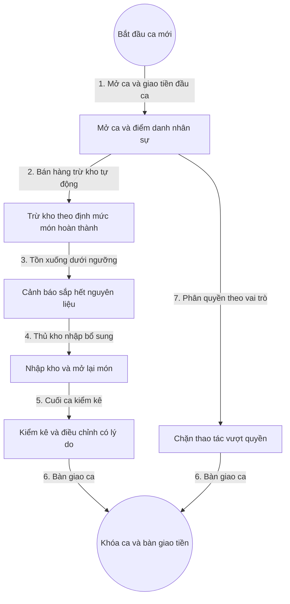

# 6. Quản Lý Kho Và Nhân Sự

## 1. Mục Tiêu

- Nguyên liệu không bị âm kho, cảnh báo sớm trước khi hết giờ cao điểm.
- Mỗi nhân viên chỉ thấy và làm đúng việc theo vai trò.
- Ca làm việc rõ người, rõ giờ, rõ trách nhiệm tiền bạc.

## 2. Mô Hình Dữ Liệu

- Nguyên liệu: tên, đơn vị tính, tồn hiện tại, ngưỡng cảnh báo.
- Phiếu nhập, phiếu xuất, phiếu kiểm kê điều chỉnh.
- Tài khoản: tên đăng nhập, vai trò, mã PIN ca.
- Vai trò: Phục vụ, Thu ngân, Bếp, Quản lý, Chủ quán.
- Ca làm việc: người, giờ vào, giờ ra, tiền đầu ca.

## 3. Quy Tắc

- Bếp báo hoàn thành món thì tự trừ kho theo định mức, thiếu kho thì chặn và báo nhập bổ sung.
- Chỉ thủ kho và quản lý được nhập kho và điều chỉnh kiểm kê có lý do.
- Hết ca tự khóa tài khoản trên thiết bị chung, đăng nhập lại phải nhập PIN.
- Nhật ký thao tác nhạy cảm không được xóa hay sửa.

## 4. Flowchart Chi Tiết

| Bước | Tác nhân | Hành động | Dữ liệu truyền | Kết quả mong đợi |
|---|---|---|---|---|
| 1 | Quản lý | Mở ca | Danh sách nhân sự, tiền đầu ca | Ca được mở, nhân viên điểm danh |
| 2 | Hệ thống | Trừ kho | Định mức món | Tồn kho giảm đúng số lượng |
| 3 | Hệ thống | Cảnh báo | Ngưỡng tồn | Màn hình kho và bếp cùng thấy cảnh báo |
| 4 | Thủ kho | Nhập kho | Phiếu nhập | Tồn tăng, món tạm hết được mở lại |
| 5 | Thủ kho | Kiểm kê | Số lượng thực tế | Chênh lệch có lý do và người xác nhận |
| 6 | Thu ngân | Bàn giao | Tiền kiểm đếm | Ca khóa, trách nhiệm rõ ràng |
| 7 | Hệ thống | Kiểm tra quyền | Vai trò, thao tác | Chặn vượt quyền kèm thông báo |

**Ý nghĩa và ràng buộc cốt lõi**: Trừ kho tự động gắn với sự kiện bếp hoàn thành để số kho khớp số bán. Mọi nhập và điều chỉnh đều giữ vết để chống thất thoát. Phân quyền ở tầng nghiệp vụ chứ không chỉ ẩn nút giao diện.

## 5. API Contract (Tóm Tắt)

- Nhập kho: nhận danh sách nguyên liệu và số lượng, trả về phiếu nhập.
- Điều chỉnh kiểm kê: nhận tồn thực tế và lý do, trả về phiếu điều chỉnh.
- Mở và khóa ca: nhận nhân sự và tiền đầu ca hoặc tiền kiểm đếm.

## 6. Gợi Ý Giao Diện

- Màn hình kho: thẻ nguyên liệu sắp hết màu cảnh báo, nút nhập nhanh.
- Màn hình nhân sự: danh sách ca trực, nút khóa nhanh khi đổi người dùng chung máy.
