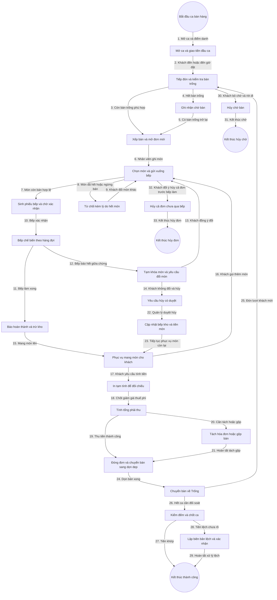

# 7. Tổng Hợp Flowchart — Ứng Dụng Quản Lý Nhà Hàng

## 1. Toàn Bộ Context Tổng Hợp

- **Đầu vào**: Khách đến trực tiếp hoặc phiếu đặt bàn trước, thực đơn đang mở bán, sơ đồ bàn, nhân sự trong ca.
- **Đầu ra**: Hóa đơn đã thanh toán, bàn về trạng thái Trống, kho đã trừ, ca được đối soát, báo cáo doanh thu.
- **Trạng thái xuyên suốt**:
  - Bàn: Trống, Đã đặt trước, Đang phục vụ, Đang dọn dẹp, Tạm ngưng.
  - Đơn: Mới mở, Đang phục vụ, Chờ thanh toán, Đã thanh toán, Đã hủy.
  - Dòng món: Chờ bếp xác nhận, Đang chế biến, Đã hoàn thành, Đã hủy có duyệt.
- **Ranh giới hệ thống**: Bên trong là 8 bounded context đã nêu ở file 1. Bên ngoài là khách hàng, thiết bị bếp, máy in, cổng thanh toán.
- **Nguyên tắc kiến trúc**: SOLID, DDD, Hexagonal, Clean Architecture đa module, CQRS cho báo cáo tách khỏi ghi đơn, sự kiện thời gian thực cho bàn đơn bếp.

## 2. Sơ Đồ Flowchart Tổng Thể

## 3. Bảng Tra Cứu Luồng Đánh Số

| Bước | Tác nhân | Hành động | Dữ liệu truyền | Kết quả mong đợi |
|---|---|---|---|---|
| 1 | Quản lý | Mở ca | Nhân sự, tiền đầu ca | Ca mở, thiết bị sẵn sàng |
| 2 | Nhân viên phục vụ | Tiếp đón | Số người, giờ đặt | Biết xếp bàn hay ghi chờ |
| 3 | Nhân viên phục vụ | Xếp bàn | Mã bàn | Bàn giữ chỗ tạm |
| 4 | Nhân viên phục vụ | Ghi chờ | Tên khách, điện thoại | Khách vào hàng đợi |
| 5 | Hệ thống | Báo bàn trống | Sự kiện bàn trống | Gợi ý xếp khách chờ |
| 6 | Nhân viên phục vụ | Ghi món | Mã món, số lượng, ghi chú | Giỏ món chờ kiểm tra |
| 7 | Hệ thống | Kiểm tra còn bán | Mã món | Sinh dòng món và phiếu bếp |
| 8 | Hệ thống | Từ chối món hết | Mã món | Báo lý do rõ ràng |
| 9 | Khách hàng | Đổi món | Món thay thế | Quay lại ghi món |
| 10 | Nhân viên bếp | Xác nhận | Mã phiếu bếp | Món sang Đang chế biến |
| 11 | Nhân viên bếp | Báo xong | Mã dòng món | Món sang Đã hoàn thành |
| 12 | Nhân viên bếp | Báo hết | Mã món | Khóa món tạm thời |
| 13 | Khách hàng | Đồng ý đổi | Món mới | Ghi món mới |
| 14 | Nhân viên phục vụ | Yêu cầu hủy | Lý do hủy | Chờ quản lý duyệt |
| 15 | Nhân viên phục vụ | Mang món | Mã dòng món | Khách nhận món |
| 16 | Khách hàng | Gọi thêm | Món bổ sung | Lặp vòng bếp |
| 17 | Thu ngân | In tạm tính | Mã đơn | Khách đối chiếu |
| 18 | Thu ngân | Tính tổng | Giảm giá, thuế phí | Tổng phải thu chính xác |
| 19 | Thu ngân | Thu tiền | Phương thức | Ghi nhận thanh toán |
| 20 | Thu ngân | Tách gộp | Dòng món, mã đơn | Cấu trúc hóa đơn mới khớp tổng gốc |
| 21 | Hệ thống | Hoàn tất tách gộp | Hóa đơn con | Sẵn sàng đóng đơn |
| 22 | Quản lý | Duyệt hủy | Mã duyệt | Món hủy không tính tiền |
| 23 | Hệ thống | Cập nhật sau hủy | Bếp, kho | Tiếp tục phục vụ phần còn lại |
| 24 | Nhân viên phục vụ | Dọn bàn | Mã bàn | Bàn sang Đang dọn dẹp rồi về Trống |
| 25 | Hệ thống | Xoay vòng bàn | Sự kiện bàn trống | Đón lượt mới |
| 26 | Thu ngân | Chốt ca | Tiền kiểm đếm | Khóa ca |
| 27 | Hệ thống | Đối soát khớp | Tổng thu | Kết thúc thành công |
| 28 | Thu ngân | Lập biên bản lệch | Số lệch, lý do | Chờ xác nhận quản lý |
| 29 | Quản lý | Xác nhận lệch | Chữ ký duyệt | Đóng ca có biên bản |
| 30 | Khách hàng | Bỏ chờ | Mã chờ | Giải phóng hàng đợi |
| 31 | Hệ thống | Kết thúc chờ | Lịch sử chờ | Đóng luồng chờ |
| 32 | Khách hàng | Hủy cả đơn sớm | Mã đơn | Hủy khi chưa qua bếp |
| 33 | Hệ thống | Đóng đơn hủy | Lý do hủy | Bàn về Trống |

## 4. Ý Nghĩa Và Ràng Buộc Cốt Lõi

- **Bao trùm đầu cuối**: Sơ đồ đi từ Mở ca đến 4 đầu kết thúc: thành công, hủy chờ, hủy đơn, chốt ca có biên bản. Không có nhánh cụt.
- **Cạnh cứng vuông vức**: Dùng graph TD phân tầng, mọi chuyển đổi đều đánh số từ 1 đến 33 để đối chiếu 1-1 sang Use Case và State Machine khi lập trình.
- **Chống thất thoát**: Mọi món qua bếp mới được tính tiền, mọi hủy sau bếp đều cần duyệt, mọi giảm giá vượt hạn mức đều cần mã duyệt.
- **Chống nghẽn**: Tách luồng bếp nóng lạnh pha chế bằng phiếu bếp riêng, sắp xếp theo giờ gọi để món chờ lâu nổi lên trước.
- **Chống sai trạng thái**: Giao dịch nguyên tử cho mở đơn đổi bàn, thêm món sinh phiếu, thu tiền đóng đơn. Khóa lạc quan chống mở trùng đơn.
- **Thời gian thực và ngoại tuyến**: Đẩy sự kiện dưới 5 giây, hàng đợi ngoại tuyến cho ghi món, cấm chốt tiền khi chưa đồng bộ.
- **Sẵn sàng lập trình**: Tên trạng thái trong sơ đồ là tên Enum trong code. Mỗi bước là một Use Case: MoCa, XepBan, GhiMon, XacNhanBep, HoanThanhMon, TamTinh, ChotHoaDon, TachGop, ChotCa.

## 5. Kết Luận Và Bước Tiếp Theo

- Hồ sơ đợt đầu đã đủ để bước vào Design Backend và Design UI chi tiết.
- Điểm còn mờ cần chốt qua vòng lặp vấn đáp: mô hình phục vụ, chia quầy bếp, chính sách thuế phí giảm giá, khách tự gọi món hay không.
- Chất lượng khi lập trình phải đạt Test Coverage tối thiểu 97 phần trăm, không có TODO, tài liệu hóa 100 phần trăm Public API.
