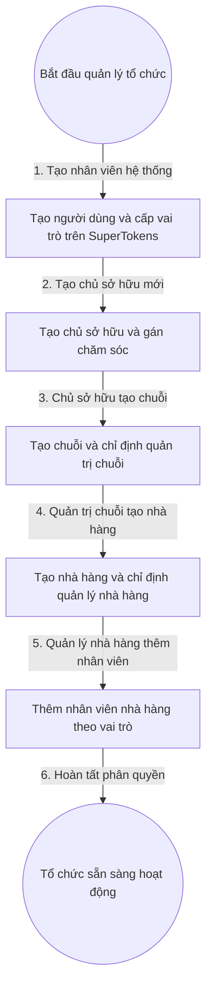

# 2. Quản Lý Tổ Chức Và Phân Quyền (Đã chốt Q1 Q2 Q6)

> Phạm vi: Quản trị hệ thống, Nhân viên hệ thống, Chủ sở hữu, Quản trị chuỗi, Quản lý nhà hàng, Nhân viên nhà hàng. Nền SuperTokens đã có, chỉ dùng đăng nhập và đăng ký bằng email, không dùng nhà cung cấp ngoài. (Đã chốt Q6).

## 1. Mục Tiêu

- Mọi người dùng đăng nhập bằng SuperTokens và chỉ thao tác trong đúng phạm vi được gán.
- Thay người quản trị không làm gián đoạn vận hành, không để khoảng trống không có người chịu trách nhiệm.

## 2. Mô Hình Dữ Liệu (Dự Thảo)

- Người dùng: định danh SuperTokens, họ tên, số điện thoại, trạng thái Hiệu lực và Tạm khóa.
- Gán chăm sóc: Nhân viên hệ thống, Chủ sở hữu, người gán, thời gian gán, trạng thái.
- Gán quản trị chuỗi: Chuỗi, người đảm nhiệm, thời gian hiệu lực, người chỉ định.
- Gán quản lý nhà hàng: Nhà hàng, người đảm nhiệm, thời gian hiệu lực, người chỉ định.
- Gán nhân viên nhà hàng: Nhà hàng, người đảm nhiệm, vai trò chi tiết (phục vụ, thu ngân, bếp, thủ kho).

## 3. Quy Tắc Chuyển Trạng Thái (Dự Thảo)

- Tạo người dùng mới ở trạng thái Nháp, kích hoạt SuperTokens xong mới chuyển Hiệu lực.
- Thay quản lý nhà hàng và quản trị chuỗi: tạo gán mới ở trạng thái Hiệu lực đồng thời chuyển gán cũ sang Hết hiệu lực cùng giao dịch, thu hồi phạm vi cũ trong SuperTokens. (Đã chốt Q1).
- Khóa người dùng thu hồi ngay phiên SuperTokens và chặn mọi API theo phạm vi cũ.

## 4. Flowchart Chi Tiết (Dự Thảo)

| Bước | Tác nhân | Hành động | Dữ liệu truyền | Kết quả mong đợi |
|---|---|---|---|---|
| 1 | Quản trị hệ thống | Tạo nhân viên hệ thống | Họ tên, số điện thoại, định danh SuperTokens | Nhân viên ở trạng thái Hiệu lực |
| 2 | Quản trị hệ thống | Tạo chủ sở hữu | Thông tin chủ sở hữu, danh sách chăm sóc | Chủ sở hữu gắn danh sách nhân viên hỗ trợ |
| 3 | Chủ sở hữu | Tạo chuỗi | Tên chuỗi, người làm quản trị chuỗi | Chuỗi có đúng một quản trị hiệu lực |
| 4 | Quản trị chuỗi | Tạo nhà hàng | Tên nhà hàng, người làm quản lý nhà hàng | Nhà hàng có quản trị và kho mặc định |
| 5 | Quản lý nhà hàng | Thêm nhân viên | Danh sách nhân viên và vai trò | Nhân viên chỉ thấy đúng nhà hàng |
| 6 | Hệ thống | Đồng bộ vai trò | Vai trò và phạm vi | SuperTokens và nghiệp vụ khớp nhau |

**Ý nghĩa và ràng buộc cốt lõi**: Mọi tạo và thay gán đều nguyên tử và ghi vết. Kiểm tra phạm vi ở tầng nghiệp vụ chứ không chỉ ẩn nút giao diện.

## 5. API Contract (Tóm Tắt Dự Thảo)

- Tạo người dùng tổ chức: nhận định danh SuperTokens và vai trò, trả về mã người dùng nội bộ.
- Gán chăm sóc N - N: nhận mã nhân viên hệ thống và mã chủ sở hữu, trả về mã gán.
- Chỉ định và thay quản trị: nhận mã chuỗi hoặc nhà hàng và người mới, trả về mã gán mới và khóa gán cũ.

## 6. Gợi Ý Giao Diện (Dự Thảo)

- Cây tổ chức từ hệ thống xuống nhà hàng, chọn nút nào thấy đúng phạm vi con của nút đó.
- 6 microstates cho nút Tạo, Chỉ định, Thay thế, Khóa: mặc định, di chuột, bàn phím, đang nhấn, bị cấm, đang tải.
- Phản hồi 4 tầng: cảnh báo ngay tại ô nhập, biểu ngữ trong màn hình tổ chức, thông báo trượt khi gán xong, hộp chặn khi trùng quản trị hiệu lực.
