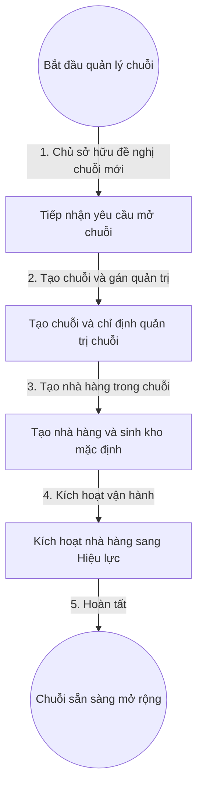

# 3. Quản Lý Chuỗi Và Nhà Hàng (Dự Thảo — Chờ Vấn Đáp)

## 1. Mục Tiêu

- Mỗi Chuỗi thuộc đúng một Chủ sở hữu. Mỗi Nhà hàng thuộc đúng một Chuỗi.
- Tạo Nhà hàng mới là có ngay Kho và Quản lý mặc định, không để Nhà hàng nửa vời.

## 2. Mô Hình Dữ Liệu (Dự Thảo)

- Chủ sở hữu: mã chủ sở hữu, tên hiển thị, thông tin liên hệ, trạng thái.
- Chuỗi: mã chuỗi, tên chuỗi, chủ sở hữu, quản trị hiệu lực, trạng thái.
- Nhà hàng: mã nhà hàng, tên nhà hàng, địa chỉ, chuỗi, quản lý hiệu lực (mỗi nhà hàng đúng 1 người), kho, trạng thái.

## 3. Quy Tắc (Dự Thảo)

- Không cho tạo Chuỗi thiếu Chủ sở hữu. Không cho tạo Nhà hàng thiếu Chuỗi.
- Tạo Nhà hàng sinh kèm Kho mặc định và gán Quản lý mặc định cùng giao dịch.
- Khóa Chuỗi khóa lan xuống tạo mới Nhà hàng nhưng không khóa Nhà hàng đang hoạt động nếu chưa xác nhận.

## 4. Flowchart Chi Tiết (Dự Thảo)

| Bước | Tác nhân | Hành động | Dữ liệu truyền | Kết quả mong đợi |
|---|---|---|---|---|
| 1 | Chủ sở hữu | Đề nghị chuỗi mới | Tên chuỗi, thông tin liên hệ | Yêu cầu được ghi nhận |
| 2 | Chủ sở hữu | Tạo chuỗi | Tên chuỗi, người làm quản trị | Chuỗi Hiệu lực, có một quản trị |
| 3 | Quản trị chuỗi | Tạo nhà hàng | Tên nhà hàng, địa chỉ, quản lý nhà hàng | Nhà hàng nháp kèm kho mặc định |
| 4 | Quản trị chuỗi | Kích hoạt | Mã nhà hàng | Nhà hàng chuyển Hiệu lực |
| 5 | Hệ thống | Hoàn tất | Sự kiện tạo xong | Sẵn sàng dựng mặt bằng và kho |

**Ý nghĩa và ràng buộc cốt lõi**: Biên giao dịch chung cho Nhà hàng, Kho, Quản lý mặc định chống dữ liệu nửa vời. Khóa lạc quan chống trùng quản lý. Nhìn từ Chuỗi là 1 Chuỗi có N Quản lý nhà hàng (mỗi nhà hàng 1 người).

## 5. API Contract (Tóm Tắt Dự Thảo)

- Tạo chuỗi: nhận mã chủ sở hữu và tên chuỗi, trả về mã chuỗi.
- Tạo nhà hàng: nhận mã chuỗi và thông tin nhà hàng, trả về mã nhà hàng và mã kho mặc định.

## 6. Gợi Ý Giao Diện (Dự Thảo)

- Danh sách chuỗi theo chủ sở hữu, bấm vào chuỗi thấy lưới nhà hàng con.
- Nút Tạo nhà hàng hướng dẫn từng bước: thông tin, quản lý, kho mặc định, xác nhận.
