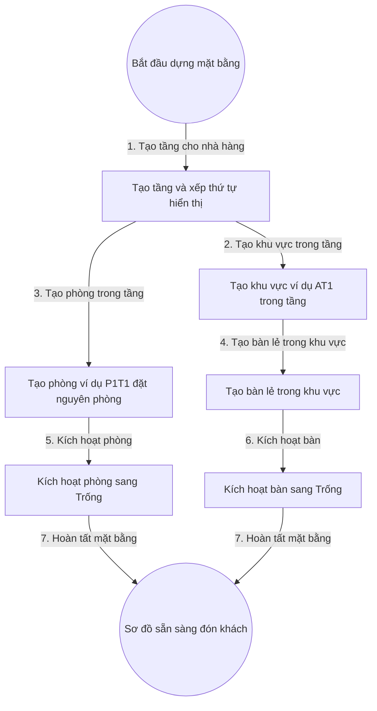

# 4. Quản Lý Mặt Bằng Tầng Khu Vực Phòng Bàn (Đã chốt Q4)

## 1. Mục Tiêu

- Mọi Bàn lẻ truy vết được: Nhà hàng, Tầng, Khu vực.
- Mọi Phòng truy vết được: Nhà hàng, Tầng. Phòng là đơn vị đặt nguyên phòng.
- Tầng chỉ nhóm hiển thị, không tham gia luồng đặt.

## 2. Mô Hình Dữ Liệu (Đã chốt Q4 ngày 04-09-2026)

- Tầng: mã tầng (ví dụ T1), tên hiển thị, nhà hàng, thứ tự sắp xếp, trạng thái. Tầng chỉ để nhóm hiển thị, không ràng buộc sức chứa hay luồng đặt.
- Khu vực: mã khu vực theo quy ước <Chữ><Tầng> (ví dụ AT1 là khu vực A tầng 1), tên hiển thị, tầng trực thuộc, trạng thái. Khu vực loại bàn lẻ chứa Bàn đặt lẻ.
- Phòng: mã phòng theo quy ước P<Tầng><Số> (ví dụ P1T1 là phòng 1 tầng 1), tên hiển thị, tầng trực thuộc, sức chứa cả phòng, trạng thái Trống và Đã đặt trước và Đang phục vụ và Đang dọn dẹp và Tạm ngưng. Phòng là đơn vị đặt nguyên phòng, không có bàn con bên trong.
- Bàn (bàn lẻ): mã bàn thuộc khu vực, tên hiển thị, khu vực trực thuộc, sức chứa, trạng thái Trống và Đã đặt trước và Đang phục vụ và Đang dọn dẹp và Tạm ngưng. Bàn chỉ thuộc Khu vực, không thuộc Phòng.

## 3. Quy Tắc (Đã chốt Q4)

- Bàn chỉ thuộc một Khu vực, không thuộc Phòng. Phòng thuộc trực tiếp một Tầng, không chứa Bàn con.
- Mã Tầng duy nhất trong Nhà hàng. Mã Khu vực duy nhất trong Tầng theo quy ước AT1. Mã Phòng duy nhất trong Tầng theo quy ước P1T1. Mã Bàn duy nhất trong Khu vực.
- Chỉ cho chuyển Bàn giữa các Khu vực khi Bàn đang Trống và không gắn đơn mở.
- Phòng đặt nguyên phòng: khi đặt là giữ cả phòng, không đặt lẻ bàn trong phòng.
- Không cho xóa cứng Tầng còn Khu vực hoặc Phòng, Khu vực còn Bàn.

## 4. Flowchart Chi Tiết (Đã chốt Q4)

| Bước | Tác nhân | Hành động | Dữ liệu truyền | Kết quả mong đợi |
|---|---|---|---|---|
| 1 | Quản lý nhà hàng | Tạo tầng | Tên tầng, thứ tự | Tầng Hiệu lực trong nhà hàng |
| 2 | Quản lý nhà hàng | Tạo khu vực | Tên khu vực, tầng | Khu vực Hiệu lực trong tầng |
| 3 | Quản lý nhà hàng | Tạo phòng | Tên phòng ví dụ P1T1, tầng, sức chứa cả phòng | Phòng Hiệu lực trong tầng, đặt nguyên phòng |
| 4 | Quản lý nhà hàng | Tạo bàn lẻ | Tên bàn, khu vực ví dụ AT1, sức chứa | Bàn lẻ gắn khu vực |
| 5 | Hệ thống | Kích hoạt phòng | Mã phòng | Phòng chuyển Trống, hiện trên sơ đồ đặt nguyên phòng |
| 6 | Hệ thống | Kích hoạt bàn | Mã bàn | Bàn chuyển Trống, hiện trên sơ đồ |
| 7 | Hệ thống | Hoàn tất | Sự kiện dựng xong | Sẵn sàng cho luồng đón khách ở 01 |

**Ý nghĩa và ràng buộc cốt lõi**: Tầng chỉ nhóm hiển thị nên mọi truy vấn đặt bàn lọc theo Khu vực hoặc Phòng, không lọc cứng theo Tầng. Phòng đặt nguyên phòng nên trạng thái phòng tuân cùng máy trạng thái như bàn ở 01. Chuyển bàn lẻ giữa các khu vực ghi vết đường dẫn cũ và mới. Sơ đồ phát sự kiện thời gian thực cho màn hình ở 01.

## 5. API Contract (Đã chốt Q4)

- Tạo tầng: nhận mã nhà hàng.
- Tạo khu vực: nhận mã tầng, mã hiển thị theo quy ước AT1.
- Tạo phòng: nhận mã tầng, mã hiển thị theo quy ước P1T1, sức chứa cả phòng.
- Tạo bàn lẻ: nhận mã khu vực.
- Chuyển bàn lẻ: nhận mã bàn và khu vực đích, chỉ cho khi bàn trống.

## 6. Gợi Ý Giao Diện (Đã chốt Q4)

- Cây mặt bằng: Nhà hàng, Tầng, nhánh Khu vực chứa Bàn lẻ và nhánh Phòng đặt nguyên phòng. Kéo thả bàn lẻ giữa các khu vực khi trống.
- Sơ đồ bàn kế thừa màu trạng thái ở 01, thêm bộ lọc theo tầng và khu vực.
