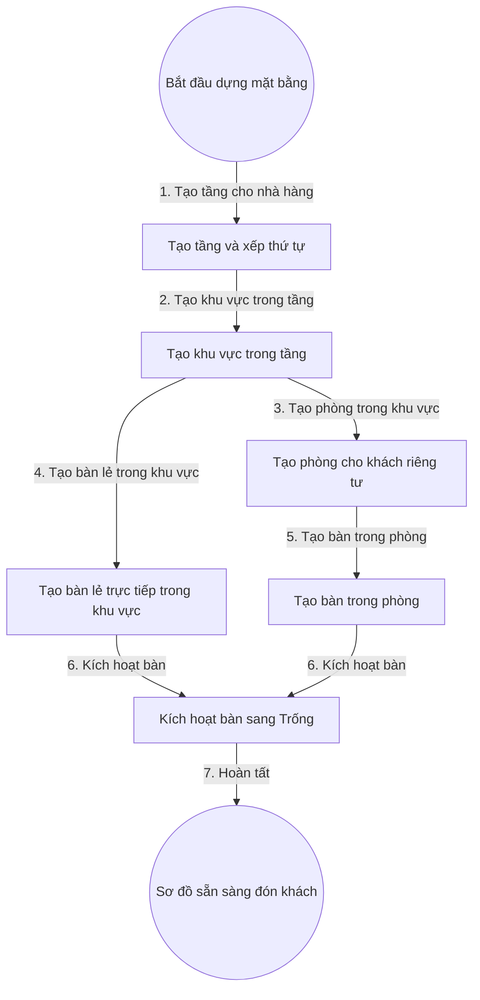

# 4. Quản Lý Mặt Bằng Tầng Khu Vực Phòng Bàn (Dự Thảo — Chờ Vấn Đáp)

## 1. Mục Tiêu

- Mọi Bàn truy vết được đường dẫn đầy đủ: Nhà hàng, Tầng, Khu vực, Phòng (nếu có).
- Hỗ trợ cả Bàn trong Phòng kín và Bàn lẻ đặt trực tiếp trong Khu vực.

## 2. Mô Hình Dữ Liệu (Dự Thảo)

- Tầng: mã tầng, tên hiển thị, nhà hàng, thứ tự sắp xếp, trạng thái.
- Khu vực: mã khu vực, tên hiển thị, tầng, loại khu vực, trạng thái.
- Phòng: mã phòng, tên hiển thị, khu vực, sức chứa, trạng thái.
- Bàn: mã bàn, tên hiển thị, khu vực, phòng (để trống nếu là bàn lẻ), sức chứa, trạng thái Trống và Đã đặt trước và Đang phục vụ và Đang dọn dẹp và Tạm ngưng.

## 3. Quy Tắc (Dự Thảo)

- Bàn chỉ được gắn hoặc Phòng hoặc Khu vực trực tiếp, không gắn cả hai.
- Mã Bàn duy nhất trong Nhà hàng. Mã Tầng duy nhất trong Nhà hàng. Mã Khu vực duy nhất trong Tầng. Mã Phòng duy nhất trong Khu vực.
- Chỉ cho chuyển Bàn khi Bàn đang Trống và không gắn đơn mở.
- Không cho xóa cứng Tầng còn Khu vực, Khu vực còn Phòng hoặc Bàn, Phòng còn Bàn.

## 4. Flowchart Chi Tiết (Dự Thảo)

| Bước | Tác nhân | Hành động | Dữ liệu truyền | Kết quả mong đợi |
|---|---|---|---|---|
| 1 | Quản trị nhà hàng | Tạo tầng | Tên tầng, thứ tự | Tầng Hiệu lực trong nhà hàng |
| 2 | Quản trị nhà hàng | Tạo khu vực | Tên khu vực, tầng | Khu vực Hiệu lực trong tầng |
| 3 | Quản trị nhà hàng | Tạo phòng | Tên phòng, khu vực, sức chứa | Phòng Hiệu lực trong khu vực |
| 4 | Quản trị nhà hàng | Tạo bàn lẻ | Tên bàn, khu vực, sức chứa | Bàn lẻ gắn trực tiếp khu vực |
| 5 | Quản trị nhà hàng | Tạo bàn trong phòng | Tên bàn, phòng, sức chứa | Bàn gắn phòng, truy vết được khu vực và tầng |
| 6 | Hệ thống | Kích hoạt | Mã bàn | Bàn chuyển Trống, hiện trên sơ đồ |
| 7 | Hệ thống | Hoàn tất | Sự kiện dựng xong | Sẵn sàng cho luồng đón khách ở 01 |

**Ý nghĩa và ràng buộc cốt lõi**: Kiểm tra loại trừ Phòng và Khu vực ở tầng nghiệp vụ. Chuyển bàn ghi vết đường dẫn cũ và mới. Sơ đồ phát sự kiện thời gian thực cho màn hình ở 01.

## 5. API Contract (Tóm Tắt Dự Thảo)

- Tạo tầng, khu vực, phòng, bàn: nhận mã cha và thông tin hiển thị, trả về mã mới.
- Chuyển bàn: nhận mã bàn và đích mới (phòng hoặc khu vực), chỉ cho khi bàn trống.

## 6. Gợi Ý Giao Diện (Dự Thảo)

- Cây mặt bằng: Nhà hàng, Tầng, Khu vực, Phòng, Bàn. Kéo thả bàn để chuyển vị trí khi trống.
- Sơ đồ bàn kế thừa màu trạng thái ở 01, thêm bộ lọc theo tầng và khu vực.
