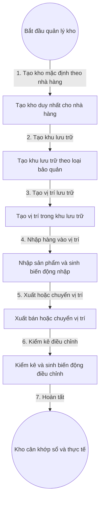

# 5. Quản Lý Kho Đa Cấp Và Biến Động Kho (Dự Thảo — Chờ Vấn Đáp)

## 1. Mục Tiêu

- Mỗi Nhà hàng có đúng một Kho. Mọi vị trí và tồn kho truy vết được từ Kho xuống Vị trí lưu trữ.
- Mọi nhập, xuất, chuyển vị trí, điều chỉnh đều sinh Biến động kho, tồn không âm.

## 2. Mô Hình Dữ Liệu (Dự Thảo)

- Kho: mã kho, tên kho, nhà hàng, trạng thái. Mỗi nhà hàng một kho hiệu lực.
- Khu lưu trữ: mã khu, tên hiển thị, kho, loại bảo quản, trạng thái.
- Vị trí lưu trữ: mã vị trí, tên hiển thị, khu lưu trữ, sức chứa, trạng thái.
- Dòng tồn kho: vị trí lưu trữ, sản phẩm, số lượng tồn, thời gian cập nhật.
- Biến động kho: mã biến động, kho, sản phẩm, vị trí nguồn, vị trí đích, loại (Nhập, Xuất, Chuyển vị trí, Điều chỉnh kiểm kê), số lượng, người thực hiện, thời gian, lý do.

## 3. Quy Tắc (Dự Thảo)

- Cặp Vị trí và Sản phẩm chỉ có một Dòng tồn kho hiệu lực.
- Xuất và chuyển đi không vượt tồn khả dụng tại vị trí nguồn.
- Nhập và sinh dòng tồn phải cùng một giao dịch với Biến động kho loại Nhập.
- Chuyển vị trí sinh một Biến động kho ghi cả nguồn và đích, trừ nguồn và cộng đích nguyên tử.

## 4. Flowchart Chi Tiết (Dự Thảo)

| Bước | Tác nhân | Hành động | Dữ liệu truyền | Kết quả mong đợi |
|---|---|---|---|---|
| 1 | Hệ thống | Tạo kho mặc định | Mã nhà hàng | Kho Hiệu lực duy nhất |
| 2 | Quản trị nhà hàng | Tạo khu lưu trữ | Tên khu, loại bảo quản | Khu Hiệu lực trong kho |
| 3 | Quản trị nhà hàng | Tạo vị trí | Tên vị trí, khu lưu trữ | Vị trí Hiệu lực, sẵn sàng chứa hàng |
| 4 | Thủ kho | Nhập hàng | Vị trí, sản phẩm, số lượng | Dòng tồn tăng, có biến động nhập |
| 5 | Thủ kho | Xuất và chuyển | Vị trí nguồn, đích, sản phẩm, số lượng | Tồn nguồn giảm, đích tăng, có biến động |
| 6 | Thủ kho | Kiểm kê | Tồn thực tế, lý do | Chênh lệch có biến động điều chỉnh |
| 7 | Hệ thống | Đối soát | Tổng tồn và tổng biến động | Sổ khớp thực tế |

**Ý nghĩa và ràng buộc cốt lõi**: Mọi thay đổi tồn đều qua Biến động kho để truy vết. Chặn tồn âm tại máy chủ. Gắn Biến động với Kho và Sản phẩm để báo cáo theo nhà hàng và theo món.

## 5. API Contract (Tóm Tắt Dự Thảo)

- Tạo khu và vị trí: nhận mã cha, trả về mã mới.
- Nhập hàng: nhận vị trí, sản phẩm, số lượng; trả về dòng tồn và biến động.
- Xuất và chuyển: nhận nguồn, đích, sản phẩm, số lượng; kiểm tra tồn trước khi ghi.
- Điều chỉnh kiểm kê: nhận tồn thực tế và lý do, sinh biến động điều chỉnh.

## 6. Gợi Ý Giao Diện (Dự Thảo)

- Cây kho: Kho, Khu lưu trữ, Vị trí lưu trữ. Thẻ vị trí hiện tồn theo sản phẩm.
- Cảnh báo tồn thấp ngay tại ô vị trí, biểu ngữ trong màn hình kho, thông báo trượt khi nhập xong, hộp chặn khi xuất vượt tồn.
