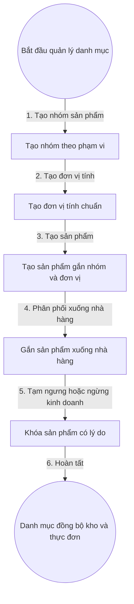

# 6. Quản Lý Danh Mục Sản Phẩm Nhóm Và Đơn Vị (Dự Thảo — Chờ Vấn Đáp)

## 1. Mục Tiêu

- Thống nhất Nhóm sản phẩm, Đơn vị tính, Sản phẩm để dùng chung cho thực đơn ở 01 và tồn kho ở file 5.
- Giữ lịch sử đổi nhóm và đơn vị, không làm sai lệch chứng từ cũ.

## 2. Mô Hình Dữ Liệu (Dự Thảo)

- Nhóm sản phẩm: mã nhóm, tên nhóm, phạm vi áp dụng (chờ chốt: hệ thống hay chuỗi), thứ tự hiển thị, trạng thái.
- Đơn vị tính: mã đơn vị, tên hiển thị, ký hiệu, phạm vi áp dụng, trạng thái.
- Sản phẩm: mã sản phẩm, tên sản phẩm, nhóm, đơn vị, định mức tham khảo, trạng thái Còn kinh doanh và Tạm ngưng và Ngừng kinh doanh.

## 3. Quy Tắc (Dự Thảo)

- Mỗi Sản phẩm thuộc một Nhóm và một Đơn vị tại thời điểm tạo.
- Đổi nhóm và đơn vị chỉ áp dụng cho chứng từ mới, chứng từ cũ giữ giá trị lịch sử.
- Không cho xóa cứng Nhóm còn Sản phẩm, Đơn vị còn Sản phẩm. Chỉ cho khóa mềm.
- Sản phẩm ngừng kinh doanh không cho nhập kho mới và không hiện trên thực đơn mới.

## 4. Flowchart Chi Tiết (Dự Thảo)

| Bước | Tác nhân | Hành động | Dữ liệu truyền | Kết quả mong đợi |
|---|---|---|---|---|
| 1 | Quản trị chuỗi | Tạo nhóm | Tên nhóm, phạm vi | Nhóm Hiệu lực |
| 2 | Quản trị chuỗi | Tạo đơn vị | Tên đơn vị, ký hiệu | Đơn vị Hiệu lực |
| 3 | Quản trị chuỗi | Tạo sản phẩm | Tên sản phẩm, nhóm, đơn vị | Sản phẩm nháp |
| 4 | Quản trị chuỗi | Phân phối | Danh sách nhà hàng | Sản phẩm hiện ở kho và thực đơn nhà hàng được chọn |
| 5 | Quản trị chuỗi | Khóa | Mã sản phẩm, lý do | Sản phẩm khóa, không cho gọi món và nhập mới |
| 6 | Hệ thống | Đồng bộ | Sự kiện danh mục | Kho và thực đơn cùng một danh mục |

**Ý nghĩa và ràng buộc cốt lõi**: Tách phạm vi dùng chung và phạm vi riêng từng nhà hàng để vừa thống nhất vừa linh hoạt giá và trạng thái mở bán. Mọi khóa mở phát sự kiện cho 01.

## 5. API Contract (Tóm Tắt Dự Thảo)

- Tạo nhóm và đơn vị: nhận tên và phạm vi, trả về mã mới.
- Tạo sản phẩm: nhận nhóm, đơn vị, tên; trả về mã sản phẩm.
- Phân phối: nhận mã sản phẩm và danh sách nhà hàng.
- Khóa và mở lại: nhận mã sản phẩm và lý do.

## 6. Gợi Ý Giao Diện (Dự Thảo)

- Bảng danh mục theo nhóm, bộ lọc theo trạng thái, ô tìm kiếm.
- Huy hiệu Tạm ngưng đè lên dòng sản phẩm, nút thêm vào thực đơn bị cấm kèm lý do.
