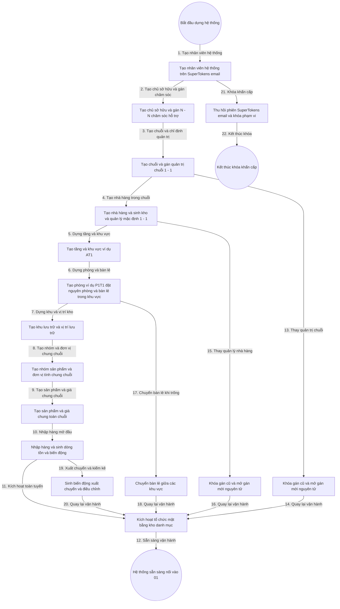

# 7. Tổng Hợp Flowchart — Quản Lý Hệ Thống Đa Cấp Nhà Hàng

> Trạng thái: **Đã chốt Q1 đến Q6 ngày 04-09-2026**. Sơ đồ dưới đây bao trùm từ Quản trị hệ thống đến Bàn và Biến động kho.

## 1. Toàn Bộ Context Tổng Hợp

- **Đầu vào**: Yêu cầu mở tổ chức mới, yêu cầu mở chuỗi và nhà hàng, sơ đồ mặt bằng dự kiến, danh mục sản phẩm, phiên SuperTokens và vai trò người gọi.
- **Đầu ra**: Cây tổ chức hiệu lực, mặt bằng sẵn sàng đón khách, kho sẵn sàng nhập hàng, danh mục đồng bộ cho thực đơn và kho, nhật ký ghi vết đầy đủ.
- **Trạng thái xuyên suốt**:
  - Tổ chức: Nháp, Hiệu lực, Tạm khóa, Đã xóa mềm, Hết hiệu lực (cho gán cũ).
  - Mặt bằng (Đã chốt Q4): Bàn lẻ và Phòng cùng dùng máy trạng thái Trống, Đã đặt trước, Đang phục vụ, Đang dọn dẹp, Tạm ngưng. Phòng đặt nguyên phòng ví dụ P1T1. Khu vực đặt bàn lẻ ví dụ AT1. Tầng chỉ nhóm hiển thị gồm Hiệu lực, Tạm khóa, Đã xóa mềm.
  - Kho: Dòng tồn gồm Hiệu lực và Hết hàng. Biến động gồm Nhập, Xuất, Chuyển vị trí, Điều chỉnh kiểm kê.
  - Danh mục (Đã chốt Q3): Sản phẩm và giá chung toàn Chuỗi gồm Còn kinh doanh, Tạm ngưng, Ngừng kinh doanh. Trạng thái mở bán riêng từng nhà hàng theo kho thực tế.
- **Ranh giới hệ thống**: Bên trong là 5 bounded context ở file 1. Bên ngoài là SuperTokens chỉ dùng đăng nhập và đăng ký bằng email, không dùng nhà cung cấp ngoài (Đã chốt Q6), màn hình vận hành ở 01, thiết bị kho.
- **Nguyên tắc kiến trúc**: SOLID, DDD, Hexagonal, Clean Architecture đa module, CQRS cho báo cáo gộp chuỗi tách khỏi ghi tổ chức, sự kiện cho mặt bằng và kho.

## 2. Sơ Đồ Flowchart Tổng Thể

## 3. Bảng Tra Cứu Luồng Đánh Số

| Bước | Tác nhân | Hành động | Dữ liệu truyền | Kết quả mong đợi |
|---|---|---|---|---|
| 1 | Quản trị hệ thống | Tạo nhân viên hệ thống | Họ tên, định danh SuperTokens | Nhân viên Hiệu lực |
| 2 | Quản trị hệ thống | Tạo chủ sở hữu | Thông tin chủ, danh sách chăm sóc | Chủ gắn danh sách hỗ trợ N - N |
| 3 | Chủ sở hữu | Tạo chuỗi | Tên chuỗi, người quản trị | Chuỗi có một quản trị hiệu lực |
| 4 | Quản trị chuỗi | Tạo nhà hàng | Tên nhà hàng, quản trị, địa chỉ | Nhà hàng kèm kho và quản lý mặc định |
| 5 | Quản lý nhà hàng | Dựng tầng khu vực | Tên tầng, tên khu vực ví dụ AT1 | Tầng nhóm hiển thị, khu vực Hiệu lực |
| 6 | Quản lý nhà hàng | Dựng phòng và bàn lẻ | Phòng ví dụ P1T1 đặt nguyên phòng, bàn lẻ trong khu vực | Phòng và bàn truy vết đủ đường dẫn |
| 7 | Quản lý nhà hàng | Dựng kho | Tên khu lưu trữ, vị trí | Vị trí sẵn sàng chứa hàng |
| 8 | Quản trị chuỗi | Tạo nhóm đơn vị | Tên nhóm, tên đơn vị chung chuỗi | Nhóm và đơn vị Hiệu lực toàn chuỗi |
| 9 | Quản trị chuỗi | Tạo sản phẩm | Tên sản phẩm, nhóm, đơn vị, giá chung chuỗi | Sản phẩm và giá giống nhau mọi nhà hàng |
| 10 | Thủ kho | Nhập mở đầu | Vị trí, sản phẩm, số lượng | Dòng tồn và biến động nhập |
| 11 | Hệ thống | Kích hoạt | Mã tổ chức, mặt bằng, kho | Toàn tuyến Hiệu lực |
| 12 | Hệ thống | Bàn giao sang 01 | Sự kiện sẵn sàng | Vận hành đón khách gọi món thanh toán |
| 13 | Chủ sở hữu | Thay quản trị chuỗi | Người mới, lý do | Gán cũ hết hiệu lực, gán mới hiệu lực |
| 14 | Hệ thống | Đồng bộ vai trò | Phạm vi mới | SuperTokens khớp phạm vi mới |
| 15 | Quản trị chuỗi | Thay quản lý nhà hàng | Người mới, lý do | Bàn giao mặt bằng và kho |
| 16 | Hệ thống | Đồng bộ vai trò | Phạm vi mới | SuperTokens khớp phạm vi mới |
| 17 | Quản lý nhà hàng | Chuyển bàn lẻ | Mã bàn, khu vực đích | Đường dẫn bàn cập nhật, có ghi vết |
| 18 | Hệ thống | Làm mới sơ đồ | Sự kiện chuyển bàn | Màn hình 01 thấy sơ đồ mới |
| 19 | Thủ kho | Biến động tiếp theo | Xuất, chuyển, kiểm kê | Tồn khớp sổ và thực tế |
| 20 | Hệ thống | Làm mới kho | Sự kiện kho | Màn hình liên quan thấy tồn mới |
| 21 | Quản trị hệ thống | Khóa khẩn cấp | Mã người dùng, lý do | Phiên bị thu hồi, phạm vi bị chặn |
| 22 | Hệ thống | Đóng luồng khóa | Biên bản khóa | Kết thúc an toàn |

## 4. Ý Nghĩa Và Ràng Buộc Cốt Lõi

- **Bao trùm đầu cuối**: Sơ đồ đi từ tạo nhân viên hệ thống đến hệ thống sẵn sàng nối vào 01, kèm 4 nhánh thay thế và khóa: thay quản trị chuỗi, thay quản lý nhà hàng, chuyển bàn, biến động kho tiếp theo, khóa khẩn cấp. Không có nhánh cụt.
- **Cạnh cứng vuông vức**: Dùng graph TD phân tầng, mọi chuyển đổi đánh số từ 1 đến 22 để đối chiếu 1-1 sang Use Case và State Machine khi lập trình.
- **Chống mồ côi**: Mọi tạo con đều kiểm tra cha hiệu lực. Tạo nhà hàng sinh kho nguyên tử. Thay quản trị khóa mở nguyên tử.
- **Chống truy cập trái phạm vi**: Mọi đọc và ghi đều lọc theo chuỗi và nhà hàng của người gọi, chặn ở tầng nghiệp vụ và cổng API.
- **Chống tồn âm và bàn lạc**: Bàn chỉ ở một nơi tại một thời điểm. Dòng tồn theo cặp vị trí và sản phẩm, xuất không vượt tồn.
- **Sẵn sàng lập trình**: Tên trạng thái trong sơ đồ là tên Enum trong code. Mỗi bước là một Use Case: TaoNhanVienHeThong, TaoChuSoHuu, TaoChuoi, TaoNhaHang, DungMatBang, DungKho, TaoDanhMuc, NhapHang, ThayQuanTri, ChuyenBan, KhoaKhanCap.

## 5. Kết Luận Và Bước Tiếp Theo

- Bản nháp v1 đã đủ khung để bước vào vòng lặp vấn đáp, chưa đủ để lập trình.
- Điểm còn mờ bắt buộc chốt qua vấn đáp: phạm vi danh mục, kiêm nhiệm quản trị, chuyển kho liên nhà hàng, sức chứa phòng, quản lý lô và hạn dùng.
- Chất lượng khi lập trình phải đạt Test Coverage tối thiểu 97 phần trăm, không có TODO, tài liệu hóa 100 phần trăm Public API.
